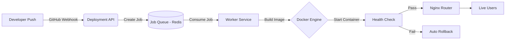

<div align="center">
  
  # 🚀 DeployMate
  
  **Zero-Downtime Deployment Orchestration Platform**

  *A cloud-native system designed to automate the build, testing, and deployment lifecycle of containerized applications with unparalleled reliability.*

</div>

---

## 📖 Overview

**DeployMate** is a robust deployment orchestration system built for modern engineering teams. It bridges the gap between development and production by enabling reliable, repeatable releases using advanced CI/CD pipelines. 

By prioritizing service availability, DeployMate ensures that your applications remain online during updates through sophisticated **rolling deployments**, **health checks**, and **automatic rollback mechanisms**.

## ✨ Key Features

- 🔄 **Automated Deployments:** Instantly triggered by GitHub push events via webhooks.
- 🐳 **Containerized Builds:** Isolated, reproducible builds using Docker.
- ⚡ **Zero-Downtime Releases:** Rolling updates ensure your service is never unavailable.
- 🛡️ **Health-Check Validation:** New deployments are rigorously verified before receiving live traffic.
- ⏪ **Auto-Rollback:** Failsafe mechanisms revert to the last stable version if a deployment fails.
- 📊 **Centralized Logging:** Comprehensive tracking and status reporting for every deployment.
- 🚦 **Intelligent Traffic Management:** Reverse proxy routing and load balancing managed by Nginx.
- 🔒 **Secure Configuration:** Granular environment variable injection and JWT-based authentication.

---

## 🏗️ System Architecture

DeployMate utilizes a microservices-inspired architecture to handle deployments asynchronously, ensuring the main API remains highly responsive.



### 🛠️ Technology Stack

| Domain | Technologies |
| :--- | :--- |
| **Frontend** | React.js, Tailwind CSS, Axios |
| **Backend API** | Node.js, Express.js, TypeScript |
| **Database** | MongoDB (Mongoose) |
| **Queue/Workers** | BullMQ, Redis |
| **Infrastructure** | Docker, Docker Compose, Nginx |
| **Cloud / CI** | AWS EC2, GitHub Actions |

---

## 🚀 Core Deployment Workflow

DeployMate operates on a seamless 8-step pipeline:

1. **Push:** Developer pushes code to the `main` branch.
2. **Trigger:** GitHub fires a secure webhook to the DeployMate API.
3. **Queue:** A new deployment job is created and pushed to Redis.
4. **Build:** The Worker service securely builds a new Docker image.
5. **Initialize:** A new container spins up parallel to the active version.
6. **Verify:** Health checks validate the new instance's operational status.
7. **Switch:** Nginx gracefully routes traffic to the new container.
8. **Cleanup:** The old container is safely terminated, ensuring **zero downtime**.

---

## 📂 Project Structure

```text
deploymate/
├── frontend/           # React SPA dashboard
├── backend/            # Express API & Mongoose Models
│   ├── Controllers/
│   ├── Models/         # User, Project, and Deployment schemas
│   └── View/
├── worker/             # BullMQ background job processor
├── nginx/              # Reverse proxy configurations
├── docker-compose.yml  # Infrastructure orchestration
└── .github/            # CI/CD pipeline definitions
```

---

## 💻 Local Development Setup

### Prerequisites

Ensure you have the following installed on your local machine:
- [Node.js](https://nodejs.org/) (v18+)
- [Docker & Docker Compose](https://www.docker.com/)
- [Git](https://git-scm.com/)

### Installation

1. **Clone the repository**
   ```bash
   git clone https://github.com/your-username/deploymate.git
   cd deploymate
   ```

2. **Install backend dependencies**
   ```bash
   cd backend
   npm install
   ```

3. **Configure Environment Variables**
   Create a `.env` file in the root/backend directories:
   ```env
   PORT=3000
   MONGO_URI=mongodb://localhost:27017/deploymate
   REDIS_HOST=localhost
   JWT_SECRET=your_super_secret_key
   WEBHOOK_SECRET=your_github_webhook_secret
   ```

4. **Start the Infrastructure**
   ```bash
   docker-compose up --build
   ```
   
> **Note:** The API will be available at `http://localhost:3000` and the frontend dashboard will be exposed on your configured ports.

---

## 🛡️ Reliability & Production Practices

This project serves as a masterclass in modern DevOps practices, demonstrating:
- **CI/CD Excellence:** End-to-end automation from code push to production.
- **Fault Isolation:** Decoupled architecture using message queues.
- **Observability:** Centralized logging and deployment history tracking.

---

## 🔮 Roadmap

- [ ] Multi-service architecture support
- [ ] Advanced Blue-Green deployment strategies
- [ ] Horizontal scaling and dynamic load balancing
- [ ] Real-time deployment metrics dashboard (WebSockets)
- [ ] Kubernetes (K8s) orchestration integration

---

<div align="center">
  <i>Built with ❤️ by the DeployMate Team</i>
</div>
